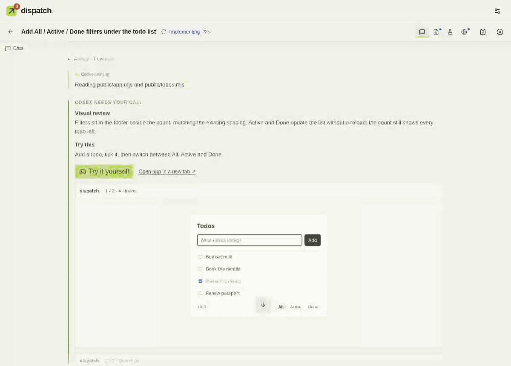
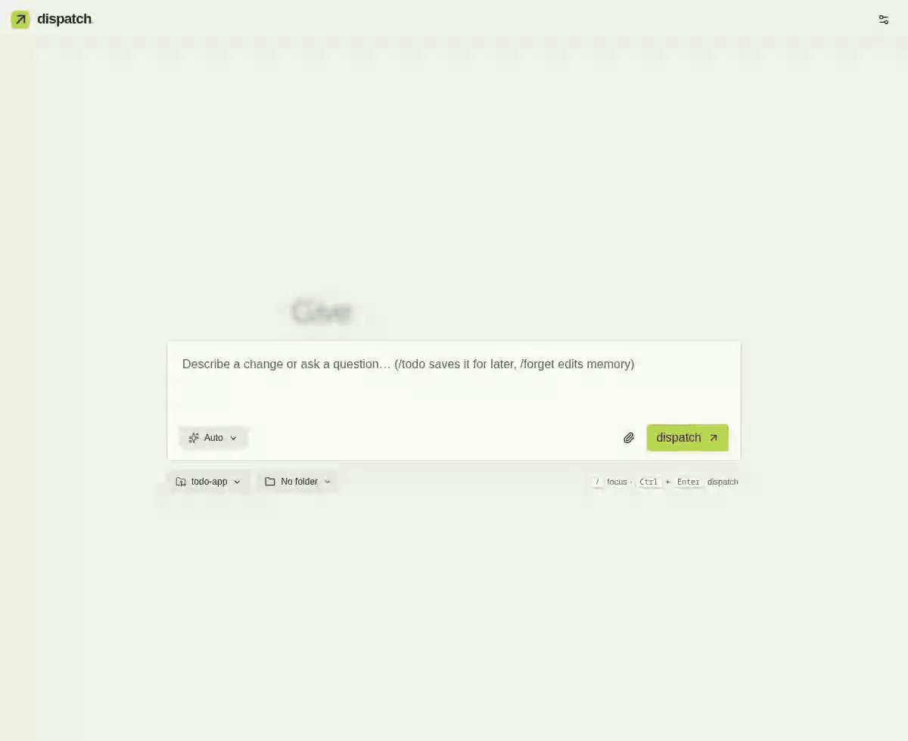
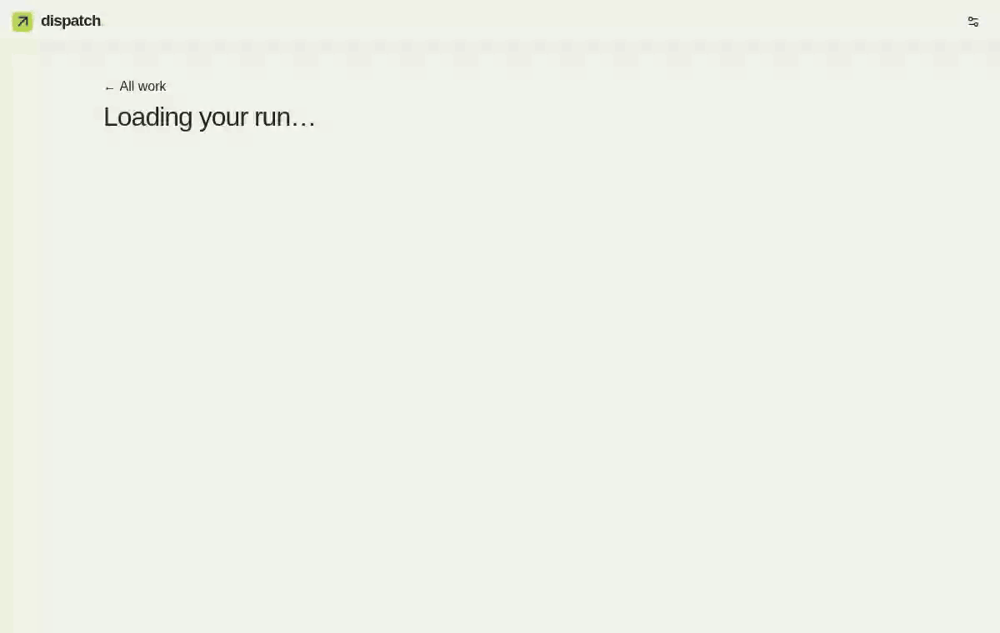

<div align="center">

#  dispatch

[](https://github.com/LOLCODED/dispatch/actions/workflows/ci.yml) [](LICENSE)

**Bring your own agent. dispatch keeps track of the work, asks you the questions that matter, and hands you a live app to test.**

dispatch is a local task desk for the coding CLIs you already use: Codex, Claude Code, Cursor, OpenCode, pi, or a local model through Ollama. Hand it your tasks, and each one gets its own Git worktree, your real checks, and a place on one board, from Todo to Completed. When the agent needs you, you get a short question with screenshots and the running app, right in dispatch.

It is not another agent. It has no agent loop of its own and calls no model API. It runs the CLI you picked and keeps each task on track. Everything runs locally, and nothing leaves your machine unless you turn it on.



</div>

## Why dispatch

I tried other harnesses and didn't stick with them. I wasn't looking for a Claude Code or Codex replacement, and I didn't want a giant agentic workflow with manager agents. I wanted something stable that I could hand tasks to, let the agents work them out, and get back two things: relevant questions, and a real playground to test the result in.

dispatch is the first time I've felt like I run a team instead of babysitting one. I steer, the agents do the work, and I'm not juggling browser tabs, terminals and context to keep up.

## Bring your own agent

dispatch sits around your agent, not in place of it.

- **Your CLI, as it is.** Codex is on by default. Claude Code, Cursor, OpenCode and pi are opt-in per provider. Each keeps its own login, sandbox and session. dispatch copies no credentials.
- **Local models too.** Point Claude Code, OpenCode or pi at Ollama, LM Studio, llama.cpp or vLLM. The agent loop is still the CLI's, so a local model gets the same worktree, checks and questions.
- **No agent loop here.** dispatch never prompts a model to route, plan or manage. Which checks run comes from the diff, and repairs and follow-ups go back to the same CLI session.

## Task tracking that keeps up with you



Every task lives on one board, grouped by where it stands: **Needs decision**, **Active**, **Queued**, **Ready for review**, **Todo** and **Completed**. Grouping comes from run status; no model decides it.

- **Folders** nest up to five deep and filter the board without moving any work.
- **Answer from the list.** Questions show their options inline. Pick one and the agent continues in the same session.
- **Pause, resume, archive, mark done.** Save ideas as Todo with `/todo` or `dispatch add "…"` from any terminal, and start them when you're ready.
- **Know when you're needed.** The tab title counts what needs you, with an optional ping when a question or result arrives.

## Questions you can actually test

When the agent works on a UI, it can stop and ask for your call with evidence attached:

- **Screenshots** it took of its own work, with captions, its assessment, and what to try.
- **Try it yourself** puts the running worktree app inside the question, so you can click through the change before answering.
- **Open app in a new tab** when you want the full window or your own devtools.
- **Choose between designs.** The agent can build two to four variants and ask which one to keep, with a screenshot of each.

Your answer goes back to the same session. "Looks good" sends the run on to its checks, and "Needs changes" takes a written note or your own screenshots.



While it works, you can watch the agent's browser live inside the run, step by step. Afterwards the Timeline replays every action with its screenshot, plus check videos and Playwright traces.

## Every result is checked

- **Isolated worktrees.** Every task gets its own branch from a freshly fetched base. Your checkout is never touched. A folder without Git works too: the agent edits it in place and dispatch still checks the exact tree it produced.
- **Checks decide "done", not the model.** Your tests, lint and build run against the exact tree the agent produced. The diff decides which checks run: a docs tweak skips your e2e suite.
- **One repair, same session.** A failing check goes back to the agent that wrote the code, with bounded failure output.
- **Delivery when you want it.** Land tasks onto a branch, or push and open a draft PR with `gh`. Every outside write is off until you turn it on for a repository.
- **Honest numbers.** Provider-reported tokens and per-phase timings for every run. Unknown stays unknown.

## Quick start

Requires macOS or Linux, Node.js 24+, Git, and at least one agent CLI you already use (Codex, Claude Code, Cursor, OpenCode or pi). dispatch never asks you to sign in; each CLI keeps its own login.

```sh
git clone https://github.com/LOLCODED/dispatch.git
cd dispatch
npm ci
npx playwright install chromium
node bin/dispatch.mjs install    # runs the latest release in the background and adds the `dispatch` command
dispatch                          # print the address
```

Open **http://127.0.0.1:4317**, add a repository, pick the checks you trust, and dispatch your first ticket.

The install puts a release in `~/.local/share/dispatch`, runs it as a user service (systemd or launchd) on port 4317, and links `dispatch` into `~/.local/bin`; it prints the line to add if that folder is not on your PATH. From then on:

```sh
dispatch                          # print the address, starting the service if it is stopped
dispatch kill                     # stop the service (refuses while runs are working unless --force)
dispatch add "Fix the header spacing"   # save a task from any terminal
dispatch repo add ~/code/site     # save a repository with the setup page's suggested checks
dispatch update                   # after tagging a new release (npm version <x.y.z>)
```

Working on dispatch itself? `npm start` runs the checkout in the foreground on port 4317 until you press Ctrl+C, and `npm run dev` runs your working copy on port 4327 with its own `.dispatch-dev/` data, rebuilding the frontend and restarting the server after each `web/` edit.

New project? Type a path that doesn't exist yet. dispatch creates the folder, with or without `git init`, and gives it a browser smoke check so the agent's first scaffold is verified too.

## How it works

```
ticket ─▶ worktree ─▶ agent turn ─▶ checks on the exact tree ─▶ local commit ─▶ (optional) push + draft PR
                          ▲                   │
                          └── one repair ─────┘
```

1. **Intake.** Ticket text, or a link a connector recognises, is normalised. The repository comes from the ticket or your only saved repository; otherwise dispatch asks. Tick several repositories for one change across them, or let the agent decide among all of them. No model routes anything.
2. **Isolate.** A new worktree and branch from the base commit. Setup recipes run outside the agent's sandbox.
3. **Implement.** One agent owns the ticket, start to finish, in one native session.
4. **Verify.** The diff decides which checks run. They run against a snapshot of the tree, and the tree is re-checked after every step.
5. **Hand off.** A local commit that matches the tested tree. Push, pull request and ticket updates happen only through connector actions you switched on.

Follow-ups, answers and repairs reuse the same session and worktree, and re-run only the checks that haven't already passed on the identical tree.

## What it isn't

- **Not an agent or an agent loop.** dispatch doesn't prompt-engineer, route, or orchestrate models. It wraps the CLIs you already trust.
- **Not hosted.** One process on your machine, bound to loopback. Commands run as your user — use trusted repositories.
- **Not an auto-merger.** Nothing is merged or deployed. You review the commit.

## Status

dispatch is early and says so. Every feature is labelled **live-verified** (run against a real provider) or **tested with doubles** (automated tests with controlled CLIs and real Git and Chromium).

- **Live-verified:** Codex runs, repairs, follow-ups, questions and review; Claude Code runs; local models through Ollama with Claude Code, OpenCode and pi; the dispatch browser on Codex and Claude Code; tasks across several repositories; check scopes; the browser smoke check; new repositories.
- **Tested with doubles:** Cursor, and OpenCode and pi with hosted models; Claude Code questions and review; UI review questions with screenshots and the live app; the live browser stage; the GitHub connector; ticket connectors (intake, comment writeback, state moves) and run-event notifications; repository memory.

## Docs

- [Guide](docs/GUIDE.md) — setup, runs, checks, browser, memory, connectors, delivery, configuration
- [Architecture](docs/ARCHITECTURE.md) — lifecycle, validation, delivery internals
- [Integrations](docs/INTEGRATIONS.md) — providers, connectors, and writing your own (tickets, delivery, notifications)
- [Contributing](CONTRIBUTING.md) · [Testing](docs/TESTING.md)

## Development

```sh
npm run check        # syntax check
npm run build
npm run test:unit
npm run e2e          # or one lane: npm run e2e:run | e2e:setup | e2e:tasks | e2e:ui | e2e:smoke
npm run dev:ui       # frontend with hot reload against a backend on 4317
```

`npm run readme:media` re-records the README GIFs against a scripted todo app (needs ffmpeg).

Automated suites use controlled CLI doubles and never touch provider credentials. `npm run live:smoke` is explicitly live and spends real Codex usage.

Backend: Node built-ins only. Frontend: React, Tailwind CSS, Vite and shadcn/ui.

## License

[MIT](LICENSE)
